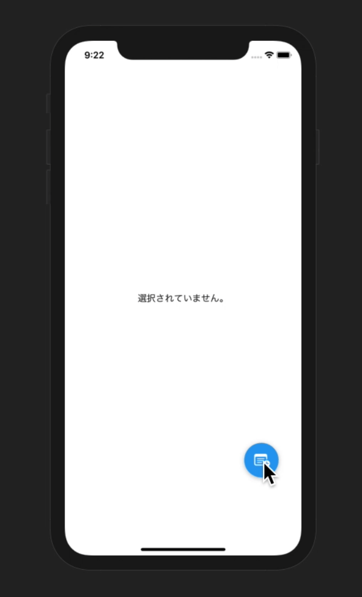

# NDTweetBtn

開発中

## QuickDemo



## Requirements

* Swift5

## Installation

comming soon

## Example

```bash
$ open NDTweetBtnExample/NDTweetBtnExample.xcworkspace
```

```swift
import NDTweetBtn

let btn = NDTweetBtn(frame: CGRect(x: 300, y: 700, width: 60, height: 60))

let action1 = NDTweetBtnAction(
    image: UIImage(systemName: "flame")!,
    handler: { (NDTweetBtnAction) -> Void in
                  print("flame")
             }
	)

btn.addAction(action: action1)

view.addSubview(btn)
```


## License

Under the MIT.